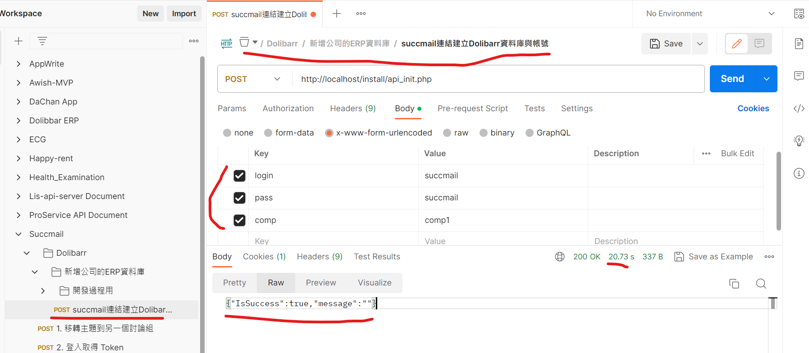
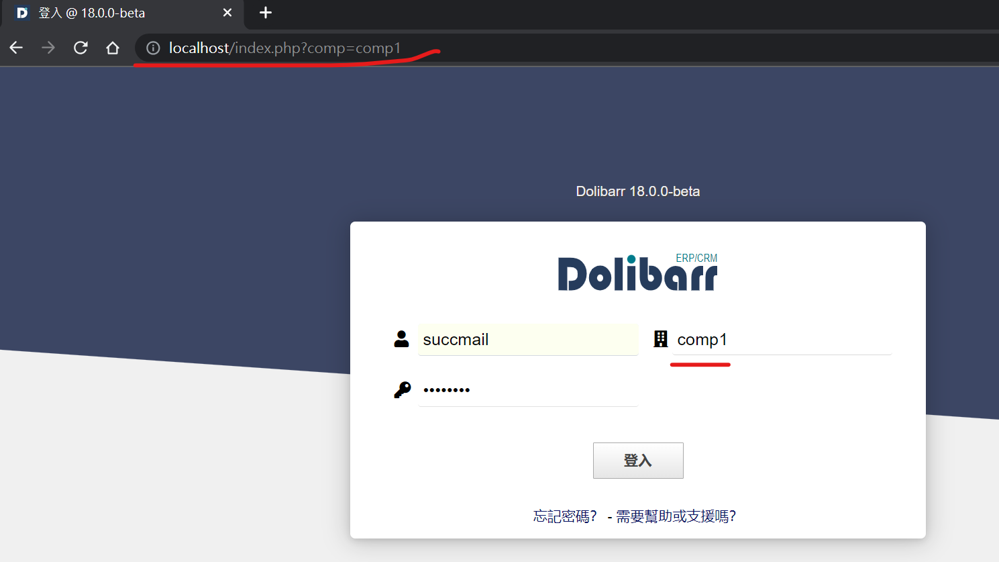
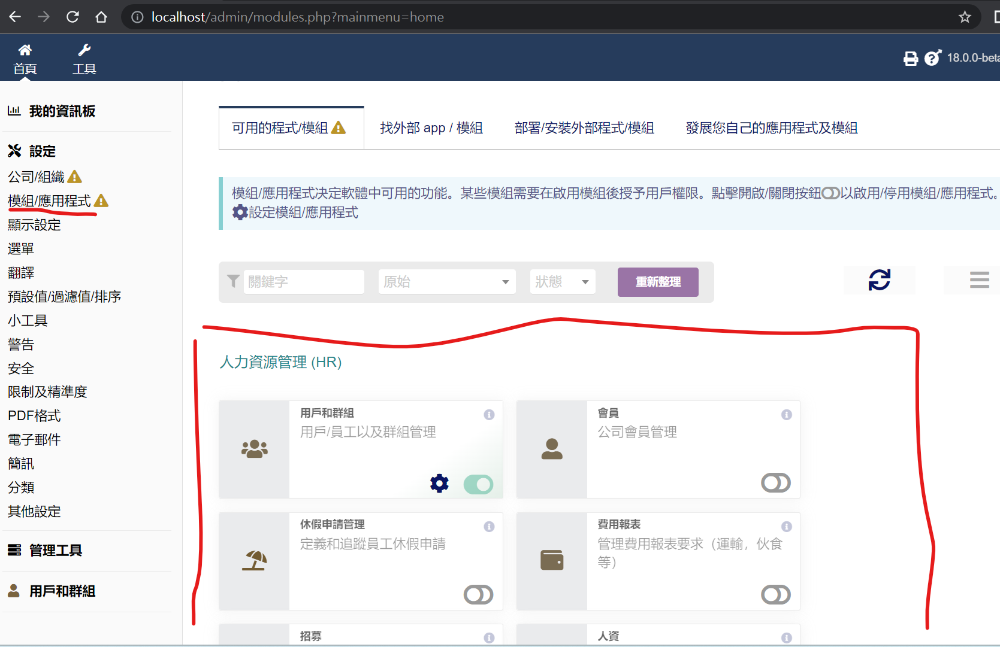

## 此版本為Succmail多公司架構串接Dolibarr使用
* 可依照不同succmail公司創建不同dolibarr ERP帳號,彼此是不同database來達成獨立ERP業務運作

### 安裝方式
* git clone此project
* mysql創建database:<b>common</b>,並且執行
* 修改htdocs/conf/init.php內的<b>root_folder</b>參數成實際server安裝dolibarr目錄
```php
<?php
$root_folder = 'D:\project\dolibarr\htdocs';
```
* 使用POST http://localhost/install/api_init.php  
api文件可看postman,如下圖

  * body要帶
    * login ---- dolibarr帳號
    * pass  ---- dolibarr密碼
    * comp  ---- 公司;串接dolibarr所有api的body都要帶comp,才知道去哪個database
  * 注意因為為創建succmail公司在dolibarr的資料庫,耗時較久,需大約20~30秒,建議succmail串接此api方式設計成非同步,以免讓使用者卡住畫面太久

### 如何使用dolibarr設定ERP模組
* 由http://localhost/index.php?comp=comp1登入(請求參數須帶入公司comp)
* 輸入帳號密碼和公司,如下圖  

* 左側選單點選<b>模組/應用程式</b>,在右側挑選要開啟的ERP模組,如下圖


### 建議php設定修改
* log設定(error_log為php log存放路徑)
  * php.ini內相關log設定改成如以下  
  ```php
  error_log = D:\php_errors.log
  log_errors = On
  ```